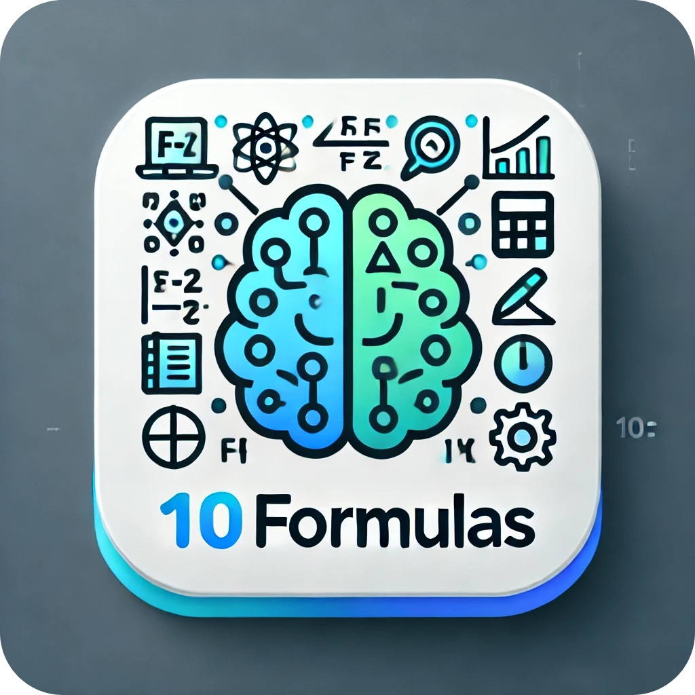

## Introduction

        

<h3>10formulas : Your Ultimate Periodic Table Companion</h3>

The goal of 10formulas is to assist students in becoming proficient with the periodic table. This application provides an extensive and engaging experience for students taking advanced chemistry classes in college or high school, helping them prepare for tests. You'll experience a distinct learning process with 10Formulas that makes it easier to memorize element names, chemical formulae, and their qualities. 

via interesting activities. It's simple to establish a solid chemical foundation using 10formulas, which guarantees that you comprehend the complexities of the periodic table beyond memorization. Ideal for students of all skill levels!

**Note : This Proram is still under development**

