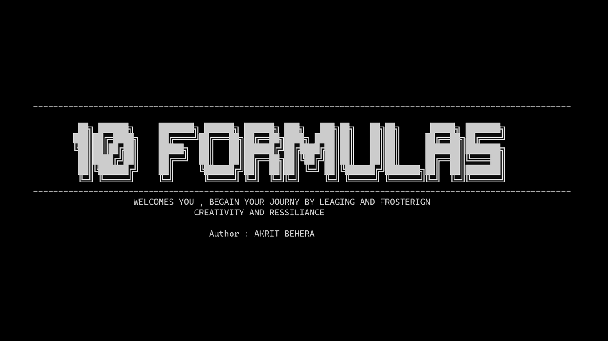

## 10formulas

<h4 align="center">10formulas : Your Ultimate Periodic Table Companion</h4>

    

10formulas is an innovative educational program designed specifically for students to master the periodic table. Whether you're a high school student or a college undergrad, 10 Formulas provides a comprehensive and interactive approach to learning and memorizing chemical formulas and element names.
